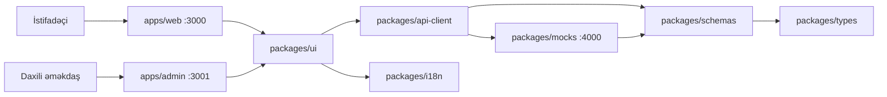

# Beş Qardaş Servis Platforması

[](https://github.com/MuradoffTehmez/besqardas-servis-platform/actions/workflows/ci.yml)
[](https://github.com/MuradoffTehmez/besqardas-servis-platform/releases)
[](.nvmrc)
[](package.json)

> **Status:** `v0.3.1`, Phase 1 frontend demo. `besqardasServis.az` işçi addır; yekun brend və production domeni təsdiqlənməyib.

Texniki servis, məhsul və ehtiyat hissələrinin satışı, müştəri cihazları, ustalar, kuryer əməliyyatları, B2B hesabları, anbar və maliyyə proseslərini vahid platformada modelləşdirən Next.js monoreposu.

- **Public və rol əsaslı tətbiq:** müştəri kabineti, usta, kuryer, korporativ, partner və topdan panelləri
- **CRM/ERP:** servis sifarişləri, dispetçer, kataloq, anbar, satınalma, satış, maliyyə, kontent və təşkilat idarəetməsi
- **Contract-first frontend:** Zod sxemləri, ortaq TypeScript tipləri və vahid API client
- **Realistik demo backend:** MSW əsaslı HTTP mock server, RBAC, state machine-lər, gecikmə/xəta/boş vəziyyət simulyasiyası
- **Lokalizasiya və SEO:** Azərbaycan dili əsas olmaqla AZ/RU/EN, SSR, canonical, `hreflang`, sitemap və strukturlaşdırılmış data
- **Keyfiyyət qapıları:** ESLint, TypeScript, Vitest, Playwright və axe-core

Tam məhsul tələbləri [PRD-də](docs/PRD.md), faktiki demo əhatəsi [DEMO sənədində](docs/DEMO.md), texniki audit isə [PROJECT_AUDIT sənədində](docs/PROJECT_AUDIT.md) saxlanılır.

## Sürətli başlanğıc

### Tələblər

- Node.js `22` (`.nvmrc`)
- Corepack
- pnpm `10.34.5` (`packageManager` sahəsi ilə sabitlənib)

### Quraşdırma

```bash
corepack enable
pnpm install --frozen-lockfile
pnpm dev
```

`pnpm dev` aşağıdakı servisləri paralel başladır:

| Servis             | Ünvan                              | Təyinat                             |
| ------------------ | ---------------------------------- | ----------------------------------- |
| Web                | <http://localhost:3000/az>         | Public sayt və rol əsaslı portallar |
| Admin              | <http://localhost:3001/az>         | Daxili CRM/ERP                      |
| Mock API           | <http://localhost:4000/api/health> | Demo HTTP API                       |
| Platforma xəritəsi | <http://localhost:3000/az/demo>    | Bütün demo modullarına keçid        |

Yalnız bir tətbiqlə işləmək üçün:

```bash
pnpm dev:web
pnpm dev:admin
pnpm mock
```

Development rejimində web və admin Mock API-ni avtomatik başladır və dayanarsa yenidən qaldırır. Xarici mock server istifadə etdikdə `MOCK_AUTOSTART=0` təyin edin.

## Demo girişləri

Demo şifrə: `Demo1234!` · OTP/2FA: `123456`

| Persona           | Giriş                                                                                                                                                          | Başlanğıc modul                    |
| ----------------- | -------------------------------------------------------------------------------------------------------------------------------------------------------------- | ---------------------------------- |
| Premium müştəri   | `aysel@demo.az`                                                                                                                                                | Müştəri kabineti                   |
| Basic müştəri     | `rashad@demo.az`                                                                                                                                               | Müştəri kabineti və plan limitləri |
| Müstəqil usta     | `elvin@demo.az`                                                                                                                                                | Usta paneli                        |
| STAFF usta        | `kamran@demo.az`                                                                                                                                               | Daxili usta axını                  |
| Usta + müştəri    | `nicat@demo.az`                                                                                                                                                | Rejim seçimi                       |
| Kuryer            | `+994553334455`                                                                                                                                                | Mobil kuryer paneli                |
| Korporativ        | `corporate@demo.az`                                                                                                                                            | Korporativ panel                   |
| Partner           | `partner@demo.az`                                                                                                                                              | Partner paneli                     |
| Topdan müştəri    | `wholesale@demo.az`                                                                                                                                            | Topdan panel                       |
| Daxili əməkdaşlar | `operator@demo.az`, `dispatcher@demo.az`, `warehouse@demo.az`, `sales@demo.az`, `accountant@demo.az`, `manager@demo.az`, `admin@demo.az`, `superadmin@demo.az` | CRM/ERP                            |

Demo hesabları və məlumatları yalnız lokal təqdimat üçündür. Onları production credential və ya real biznes məlumatı kimi istifadə etməyin.

## Arxitektura



Əsas dizayn qaydaları:

1. UI qiymət, endirim, ƏDV, stok, slot, icazə və entitlement hesablamır; server müqaviləsini göstərir.
2. Bütün demo məlumatı HTTP API vasitəsilə alınır; komponentlər seed fayllarını birbaşa import etmir.
3. Zod sxemləri API sərhədidir, TypeScript tipləri həmin müqavilədən törəyir.
4. Public səhifələr serverdə hazırlanır və eyni state ilə hidratasiya olunur; qorunan ekranlar `noindex`-dir.
5. Route, menyu və əməliyyat görünüşü rola görə süzülür, lakin real təhlükəsizlik nəzarəti backend məsuliyyətidir.

Ətraflı izah: [GitHub Wiki — Architecture](https://github.com/MuradoffTehmez/besqardas-servis-platform/wiki/Architecture).

## Monorepo strukturu

```text
apps/
  web/          Public sayt və müştəri/usta/kuryer/B2B portalları
  admin/        CRM/ERP tətbiqi
packages/
  api-client/   Fetch client və sorğu köməkçiləri
  config/       Ortaq TypeScript konfiqurasiyası
  i18n/         AZ/RU/EN mesajları və format utilitləri
  mocks/        Mock server, handler-lər, seed və state machine-lər
  schemas/      Zod API müqavilələri
  types/        Ortaq domen tipləri
  ui/           Design system, shell-lər, səhifələr və domen komponentləri
  utils/        Ümumi utilitlər
e2e/            Playwright kritik axın, SEO, mobil və a11y testləri
scripts/        Repository yoxlama skriptləri
docs/           PRD, demo, audit və release sənədləri
.github/        CI, Dependabot, issue/PR şablonları və sahiblik qaydaları
```

## Faydalı komandalar

| Komanda                       | Nəticə                                                          |
| ----------------------------- | --------------------------------------------------------------- |
| `pnpm dev`                    | Bütün development servislərini başladır                         |
| `pnpm build`                  | Hər iki Next.js tətbiqinin production build-ini yaradır         |
| `pnpm lint`                   | ESLint-i sıfır warning siyasəti ilə işlədir                     |
| `pnpm typecheck`              | Workspace TypeScript yoxlamalarını işlədir                      |
| `pnpm test`                   | Vitest unit və inteqrasiya testlərini işlədir                   |
| `pnpm test:e2e`               | Playwright kritik axın, SEO və a11y testlərini işlədir          |
| `node scripts/check-i18n.mjs` | İtkin və artıq tərcümə açarlarını yoxlayır                      |
| `pnpm check`                  | Lint, typecheck, i18n, test və build qapılarını ardıcıl işlədir |
| `pnpm format`                 | Dəstəklənən faylları Prettier ilə formatlayır                   |

İlk E2E işə salınmasından əvvəl:

```bash
pnpm exec playwright install --with-deps chromium
pnpm test:e2e
```

Windows-da artıq quraşdırılmış Chrome ilə test etmək üçün PowerShell-də:

```powershell
$env:PW_CHANNEL = "chrome"
pnpm test:e2e
```

## Konfiqurasiya

`.env.example` faylını lokal `.env.local` faylına köçürün və real sirrləri heç vaxt commit etməyin.

| Dəyişən                       | Təyinat                                         | Defolt                       |
| ----------------------------- | ----------------------------------------------- | ---------------------------- |
| `MOCK_API_URL`                | Server-side API ünvanı                          | `http://127.0.0.1:4000`      |
| `API_URL`                     | `MOCK_API_URL` olmadıqda server API alternativi | `http://127.0.0.1:4000`      |
| `NEXT_PUBLIC_SITE_URL`        | Canonical, Open Graph, sitemap və robots bazası | `https://besqardasservis.az` |
| `NEXT_PUBLIC_WEB_URL`         | Admin-dən web tətbiqinə keçid                   | cari origin / `:3000`        |
| `NEXT_PUBLIC_ADMIN_URL`       | Web-dən admin tətbiqinə keçid                   | cari host / `:3001`          |
| `MOCK_AUTOSTART`              | Development mock autostart                      | `1`; söndürmək üçün `0`      |
| `NEXT_PUBLIC_HIDE_MOCK_PANEL` | Demo idarəetmə panelini gizlədir                | `0`                          |
| `E2E_WEB_URL`                 | Playwright web base URL                         | `http://localhost:3000`      |
| `E2E_ADMIN_URL`               | Playwright admin base URL                       | `http://localhost:3001`      |
| `E2E_API_URL`                 | Playwright mock API URL                         | `http://127.0.0.1:4000`      |
| `PW_CHANNEL`                  | Lokal Playwright brauzer kanalı                 | bundled Chromium             |

Phase 1 üçün real provider credential-ları və production backend bu repoya daxil deyil.

## Keyfiyyət və test strategiyası

- Unit testlər: axtarış normallaşdırması və i18n utilitləri
- İnteqrasiya testləri: mock API, RBAC, servis state machine-ləri, checkout və anbar axınları
- E2E: autentifikasiya, geri yönləndirmə, servis sifarişi, smeta, kataloq, checkout, mobil menyu, kuryer və usta axınları
- SEO: SSR məzmunu, canonical, `hreflang`, JSON-LD, sitemap, robots və 404
- Əlçatanlıq: əsas public və kabinet səhifələrində axe WCAG 2.2 AA kritik pozuntu yoxlaması

Cari audit 205 route tərifini statik olaraq xəritələyib və kritik istifadəçi axınlarını brauzerdə yoxlayıb. Əhatə və açıq risklər [PROJECT_AUDIT.md](docs/PROJECT_AUDIT.md)-dədir.

## Production məhdudiyyətləri

Bu demo production sistemi deyil. Aşağıdakılar ayrıca backend və infrastruktur işi tələb edir:

- server-side autentifikasiya və sessiya sərtləşdirilməsi;
- hər endpoint-də RBAC və tenant izolyasiyası;
- real database, migration, backup və bərpa planı;
- provider açarlarının secret manager-də saxlanması;
- webhook imzası, idempotency, rate limiting və audit log bütövlüyü;
- real ödəniş, fiskal, SMS/e-poçt, storage və observability inteqrasiyaları;
- hüquqi mətnlərin və açıq mənbə lisenziyasının məhsul sahibi tərəfindən təsdiqi.

## Sənədlər

- [Məhsul tələbləri](docs/PRD.md)
- [Demo əhatəsi və təqdimat ssenarisi](docs/DEMO.md)
- [Layihə auditi](docs/PROJECT_AUDIT.md)
- [Release prosesi](docs/RELEASING.md)
- [Dəyişiklik tarixçəsi](CHANGELOG.md)
- [GitHub Wiki](https://github.com/MuradoffTehmez/besqardas-servis-platform/wiki)
- [Töhfə qaydaları](CONTRIBUTING.md)
- [Dəstək](SUPPORT.md)
- [Təhlükəsizlik siyasəti](SECURITY.md)
- [Davranış kodeksi](CODE_OF_CONDUCT.md)

## Töhfə və təhlükəsizlik

Dəyişiklikdən əvvəl [CONTRIBUTING.md](CONTRIBUTING.md)-ni oxuyun. Təhlükəsizlik boşluğunu public issue-da paylaşmayın; [SECURITY.md](SECURITY.md)-dəki məxfi bildiriş kanalından istifadə edin.

## Lisenziya statusu

Repository public görünə bilər, lakin hazırda təsdiqlənmiş açıq mənbə lisenziyası yoxdur. Bu, kodu istifadə etmək, dəyişdirmək və yaymaq üçün avtomatik icazə vermir. Lisenziya qərarı məhsul sahibi tərəfindən ayrıca sənədləşdirilməlidir.
